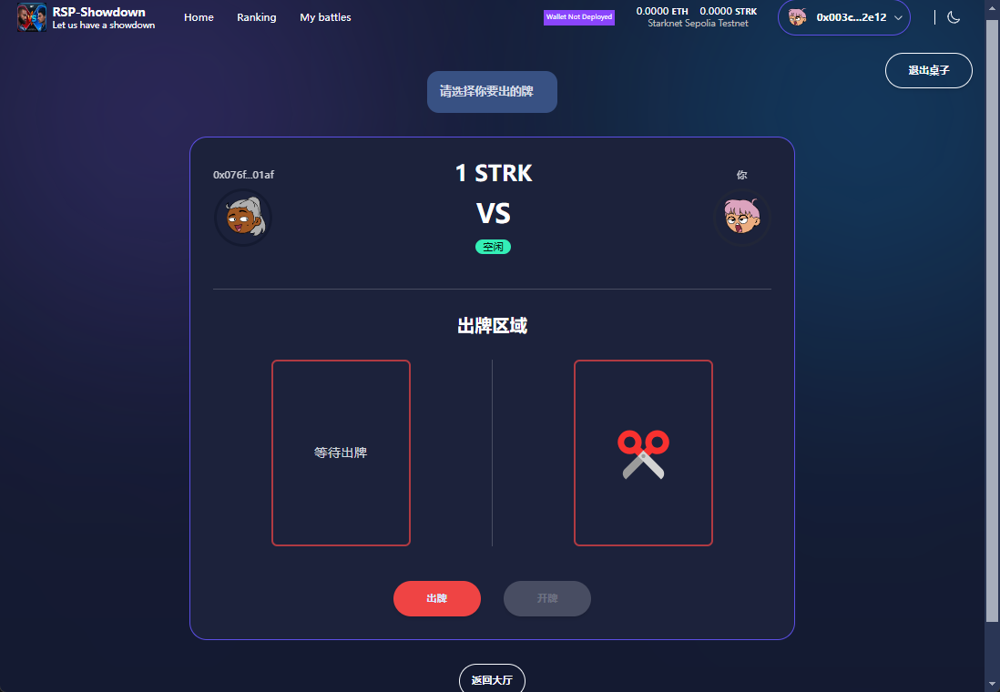

# 🏗 RSP-Showdown

<h4 align="center">

  <a href="https://rsp-showdown.vercel.app/">Demo</a>
  <a href="https://drive.google.com/file/d/14n2VfDFu6OWvtlb_Yq_Q_HDa76sU0viR/view?usp=drive_link">Documentation and design</a> |
  <a href="https://drive.google.com/file/d/1y935YYZqb88OA8ZHFuU7pEIRcyrlvYU3/view">page design </a> |
</h4>

🧪 基于区块链starknet 的石头剪刀布，分歧终端机，无需第三方参与，公平透明，一个学习starknet的好例子。fork 自 https://github.com/Scaffold-Stark/scaffold-stark-2 项目 
由cuphead 团队创作， hansen、sixgod  

⚙️ Built using NextJS, Starknet.js, Scarb, Starknet-React, Starknet Foundry and Typescript.





## Requirements

Before you begin, you need to install the following tools:

- [Node (>= v18.17)](https://nodejs.org/en/download/)
- Yarn ([v1](https://classic.yarnpkg.com/en/docs/install/) or [v2+](https://yarnpkg.com/getting-started/install))
- [Git](https://git-scm.com/downloads)
- [Rust](https://rust-lang.org/tools/install)
- [asdf](https://asdf-vm.com/guide/getting-started.html)
- [Cairo 1.0 extension for VSCode](https://marketplace.visualstudio.com/items?itemName=starkware.cairo1)

## Compatible versions

- Starknet-devnet - v0.2.3
- Scarb - v2.9.2
- Snforge - v0.34.0
- Cairo - v2.9.2
- Rpc - v0.7.1
- prisma - 5.8.1

## Quickstart with Starknet-Devnet

To get started with RSP, follow the steps below:

1. Clone this repo and install dependencies

```bash
yarn install
```

2. Run a local network in the first terminal. 如果你直接在Sepolia链上开发，可以不启动这个。

```bash
yarn chain
```

> To run a fork : `yarn chain --fork-network <URL> [--fork-block <BLOCK_NUMBER>]`

This command starts a local Starknet network using Devnet. The network runs on your local machine and can be used for testing and development. You can customize the network configuration in `scaffold.config.ts` for your nextjs app.

3. On a second terminal, deploy the sample contract:部署合约 

```bash
yarn deploy
```

This command deploys a sample smart contract to the local network. The contract is located in `packages/snfoundry/contracts/src` and can be modified to suit your needs. The `yarn deploy` command uses the deploy script located in `packages/snfoundry/scripts-ts/deploy.ts` to deploy the contract to the network. You can also customize the deploy script.

By default `Scaffold-Stark` takes the first prefunded account from `starknet-devnet` as a deployer address,

4. On a third terminal, start your NextJS app:

```bash
yarn start
```

Visit your app on: `http://localhost:3000`. You can interact with your smart contract using the `Debug Contracts` page. You can tweak the app config in `packages/nextjs/scaffold.config.ts`.

5. Check your environment variables. We have a yarn postinstall script that helps to fill in your environment variables. If the environment variable does not exist, you can fill them it manually to get the app running!

## Quickstart with Sepolia Testnet

<details>

1. Make sure you alredy cloned this repo and installed dependencies.

2. Prepare your environment variables.

Find the `packages/snfoundry/.env` file and fill the env variables related to Sepolia testnet with your own wallet account contract address and private key.

3. Change your default network to Sepolia testnet.

Find the `packages/nextjs/scaffold.config.ts` file and change the `targetNetworks` to `[chains.sepolia]`.


4. Get some testnet tokens.

You will need to get some `ETH` or `STRK` Sepolia tokens to deploy your contract to Sepolia testnet.

> Some popular faucets are [Starknet Faucet](https://starknet-faucet.vercel.app/) and [Blastapi Starknet Sepolia Eth](https://blastapi.io/faucets/starknet-sepolia-eth)

4. Open a terminal, deploy the sample contract to Sepolia testnet:

```bash
yarn deploy --network sepolia
```

5. On a second terminal, start your NextJS app:

```bash
yarn start
```

Visit your app on: `http://localhost:3000`. You can interact with your smart contract using the `Debug Contracts` page. You can tweak the app config in `packages/nextjs/scaffold.config.ts`.

### RPC specific version

To ensure the proper functioning of the scaffold-stark with Testnet or Mainnet, your RPC version must be `0.7.1`. This repository contains a `.env.example` file, where we provided the default RPC URL for the Starknet Testnet: `RPC_URL_SEPOLIA=https://starknet-sepolia.public.blastapi.io/rpc/v0_7`. Let's verify this RPC version is `0.7.1` by calling a `POST` request in an API platform like `Postman` or `Insommia` . Your API endpoint should be `https://starknet-sepolia.public.blastapi.io/rpc/v0_7` and the body should be:

```json
{
 "jsonrpc":"2.0",
 "method":"starknet_specVersion",
 "id":1
}
```

You have to paste the endpoint and body in the API platform and click on the `Send` button. If the response is `0.7.1`, then you are good to go. Otherwise, you have to get the correct RPC URL endpoint.


</details>


## vercel 部署时的问题 

### Prisma 

引入Prisma 对数据库的操作 ， 比之前的写sql操作数据库好了很多， 不再会有 很多奇怪的转换问题。
但是部署的时候，报错，
```
Prisma has detected that this project was built on Vercel, which caches dependencies.
This leads to an outdated Prisma Client because Prisma's auto-generation isn't triggered.
To fix this, make sure to run the `prisma generate` command during the build process.

Learn how: https://pris.ly/d/vercel-build
```
  
我采用的是 加script, postinstall


## Documentation

Visit our [docs](https://docs.scaffoldstark.com/) to learn how to start building with Scaffold-Stark.

To know more about its features, check out our [website](https://scaffoldstark.com)

